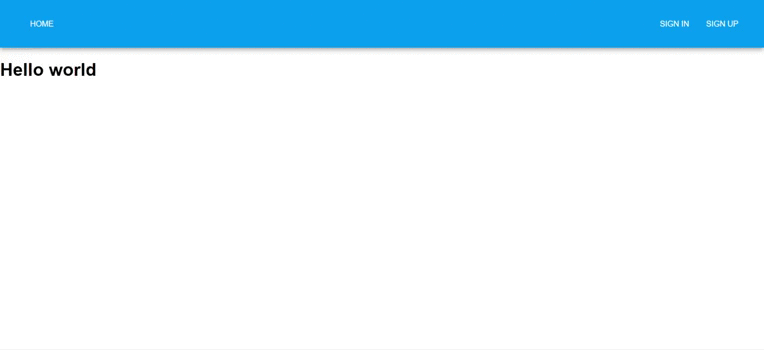

If you login as a user:

If you login as an admin:

Install MongoDB locally;

Frontend:
1. `npm install`

2. `npm start`

Backend:
1. `cd ./src/be`

2. `npm install`

3. `npm start`

At first step, you have to make registration for admin user. Admin credentials:

login: admin9999@gmail.com

password: admin9999
